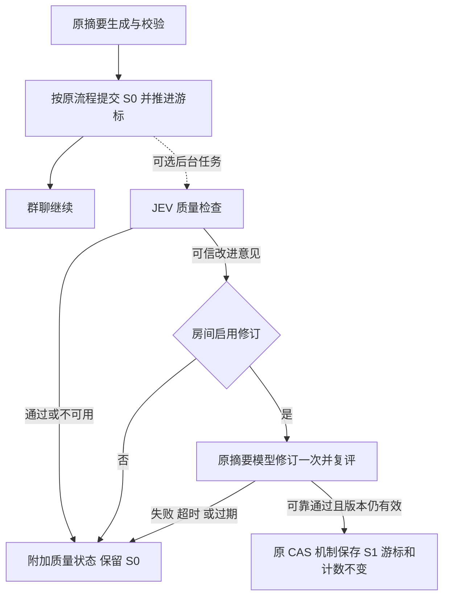

# 群聊与工作流的 JEV 增强规划

状态：待实施。本文只覆盖群聊与工作流，Ekko Agent 已有记忆、技能查找和技能学习不在本次改造范围。

本版按用户最新要求修订：**JEV 是可选增强，关闭、未配置、失败或超时均不能阻断原有业务；不改变既有数据约束与业务链路。** 本版替代此前的强制验收与自动返工方案。新增字段、服务与界面均为规划，尚未实现。

## 1. 必须保持的行为契约

1. 原业务是独立可运行的基线。没有 JEV 时，群聊消息、摘要生成与提交、工作流节点执行、分支、审批和运行结果照常处理。
2. 关闭或无凭据时零 JEV 请求。连接失败、429/5xx、超时、返回格式错误、证据不足、低置信、输入超限均放弃增强，保留基线。
3. “增强不可用”不能伪装成“质量通过”，也不能改成业务失败。界面将业务状态与质量评估分开显示。
4. 权限、原有数据校验、事务、版本检查、消息顺序、幂等和既有业务错误仍由原流程负责。JEV 不能覆盖这些确定性规则。
5. 增强结果只能在其有效对象与版本上使用。超时返回后到达的迟到结果不得继续写入、路由或触发副作用。
6. 用户取消、原任务总 deadline 到期、原业务自身失败继续按原语义处理，不能通过 JEV 的回退吞掉。
7. 增强的排队、诊断、记录和通知失败也不能回滚已经成功的主业务。增强资源有并发和队列上限，满载时跳过。

新功能采用异步旁路：摘要先按原流程提交，工作流按原图继续；随后做质量检查。自动分派只补充本来没有目标的用户消息。这样 JEV 的超时等待不计入原执行链路的必经步骤。

### 1.1 与现有记忆、skill 的关系

本次已核对实现：记忆召回先算原结果，增强失败恢复完整原结果；写入评估失败继续原校验和事务；技能查找失败保留原匹配；学习预检失败继续原完整审查。它们都具有独立时间预算，取消单独传播。

开启并获得可信判断时，当前记忆增强可以过滤普通无关记忆或拒绝不合格写入，学习预检可以跳过明确没有学习价值的审查。这些是主动启用的效果，并不等于服务失败导致业务阻断。记忆的存储结构、权限、事务和修订校验仍走原机制；不能把“可选增强”说成启用后输出也完全不变。

## 2. 交付目标与顺序

| 顺序 | 功能 | 用户获得的能力 |
| --- | --- | --- |
| 1 | 群聊摘要检查与可选修订 | 找到遗漏约束、过时结论、无依据的完成声明；有可靠修订时改善现有摘要 |
| 2 | 工作流节点质量观察 | 为节点填写质量标准，运行记录展示逐条判断和已有证据 |
| 3 | 工作流质量建议与人工重跑 | 展示需要改进的条件；用户可以编辑输入并使用已有重跑功能 |
| 4 | 群聊分派推荐 | 用户没有指定 Agent 时，推荐一个符合职责的房间成员 |
| 5 | 群聊自动分派 | 房间显式开启后，为本来没有执行目标的新任务补充分派 |

这些能力属于 Studio 群聊/工作流编排层，可覆盖 Hermes、Ekko Agent 和 Coding Agents。第一版直接增强现有 Agent 节点，不新增 JEV 节点类型。

**不交付 JEV 强制放行节点、不依据 JEV 自动改图或触发返工回环。** 现有成功/失败条件边、人工审批、反馈回环继续按原机制运行。用户以后主动修改工作流属于新的显式操作。

## 3. 已确认的代码边界

| 模块 | 现有实现 | 接入要求 |
| --- | --- | --- |
| 摘要生成与提交 | `packages/server/src/modules/studio/services/group-chat/room-summary.ts` | 保留原触发条件、租约、版本、generation、游标与条件提交；成功提交后再调度增强 |
| 群聊分派和队列 | `packages/server/src/modules/studio/services/group-chat/agent-clients.ts` | 显式 @、handoff、continuation 优先，智能分派复用原 admission 和队列 |
| 群聊存储与事件 | `packages/server/src/modules/studio/sockets/group-chat.ts` | 只做接线，质量与分派判断放独立 service |
| 工作流执行 | `packages/server/src/modules/studio/services/workflow/manager.ts` | 普通 DAG 与回环使用同一评估旁路；评估不介入出边决定 |
| 导入导出 | `packages/server/src/modules/studio/services/workflow/portability.ts` | 显式保存质量配置；兼容旧文件，不把可选质量配置变成运行前置条件 |
| 运行记录 | `packages/server/src/modules/studio/repositories/workflow-run-store.ts` | 附加评估绑定具体 execution 和 iteration，不替换原运行状态 |
| JEV facade | `packages/server/src/modules/studio/public/jev.ts` | 复用共享调用入口，业务模块不各自创建 SDK |

工作流持久化 run 状态仍为 queued/running/completed/failed/canceled。JEV 不引入新的等待、阻塞或失败状态，也不复用 blocked 来表达质量问题。

## 4. 配置与共同执行规则

### 4.1 一个连接入口，三个业务开关

Models → JEV 沿用现有连接信息，在同一页增加群聊摘要、工作流质量、群聊分派三组。新增功能默认关闭，保存 API Key 不会自动启用。

| 拟议 Profile 字段 | 初始默认值 | 含义 |
| --- | --- | --- |
| `groupSummaryReviewEnabled` | false | 开启群聊摘要质量增强 |
| `groupSummaryReviewMinConfidence` | 0.8 | 采纳摘要判断的最低置信值 |
| `groupSummaryReviewTimeoutMs` | 3000 | 一次摘要增强任务的累计 JEV 请求预算 |
| `workflowQualityEnabled` | false | 开启工作流质量观察及建议 |
| `workflowQualityMinConfidence` | 0.8 | 采纳节点质量判断的最低置信值 |
| `workflowQualityTimeoutMs` | 5000 | 单次节点执行的评估预算 |
| `groupMessageRoutingEnabled` | false | 允许群聊推荐与显式启用的自动分派 |
| `groupMessageRoutingMinConfidence` | 0.9 | 采纳分派结果的最低置信值 |
| `groupMessageRoutingTimeoutMs` | 1500 | 一条消息的分派评估预算 |

阈值范围建议 0.5–1，超时范围 100–30000 ms。它们是待校准参数，置信值不是实测正确率。全部可调项有前端控件、校验、保存回读和全部语言文案；不增加后端私有调节项。

房间增加 `evaluationProfile`，只能由有管理权限的人选择其有权使用的 Profile，默认沿用有权访问的摘要 Profile。后端校验，访客不能任意借用宿主凭据。工作流使用运行所属 Profile。

房间增加 `summaryReviewMode: inherit | off`，默认 inherit；`summaryRevisionEnabled` 默认 false，可单独开启可靠修订。分派模式为 `off | suggest | auto`，默认 off，房间显式切换 auto 才允许自动交付。

节点增加可选的 `qualityReview`：

```ts
qualityReview?: {
  mode: 'off' | 'observe'
  criteria: Array<{
    id: string
    text: string
    evidence: 'output' | 'execution'
  }>
}
```

旧节点缺字段即 off；每节点建议最多 10 条、每条最多 1000 字符。第一版不配置节点级 Key、模型、超时或阈值，继承 Profile。`execution` 条件需要实际运行证据，拿不到就 unknown。

### 4.2 时间预算、取消和配置快照

每个增强任务只有一个确定的时间预算和配置快照，配置读取失败就跳过。JEV 请求用业务剩余预算与共享 provider 超时的较小值，没有自动网络重试；即使 provider 忽略 AbortSignal，本地也必须按 deadline 返回并拒收迟到结果。

配置快照在原任务边界或可选后台任务中取得，不能新增一个阻塞原业务的凭据读取步骤。异步任务冻结来源 Profile、策略版本、授权范围和来源 hash，防止执行时串到另一个 Profile。

API Key 只在服务端内存使用，不进 run 快照、导出、socket 或日志。重启后未完成的增强可标记 skipped，不是业务恢复必须等待的任务；需要重新评估时重新授权并读配置。用户取消、对象删除、Profile 权限撤回取消对应增强。

建议单次序列化评估输入上限 64,000 UTF-8 字节，与现有 Ekko 可选增强的边界一致。超过上限整体跳过，不截断证据后给可靠判断。摘要现有批次可能更大，应记录覆盖率；将来需要分块评估再单独设计，不改变原摘要批次大小与游标语义。

JEV 使用 choice/score/noul 等受限类型。业务结果和原因码由代码校验；展示文本来自预定义规则及已有证据，不假设 JEV 能输出任意解释、修复代码或执行证明。

### 4.3 登记与资源隔离

分别注册 `group-summary-review`、`workflow-quality-review`、`group-message-routing`，各有 Profile 开关、参数、前端和测试。房间修订/自动分派是对应集成内明确登记的应用模式，所有可编辑字段均有归属；必要时同步扩展 harness 对房间局部控件的验证，不能豁免业务调用。

旁路任务采用有界队列与并发，按 Profile 公平调度。满载、队列不可用、读取质量记录失败都直接跳过增强。摘要修订模型请求使用独立并发预算，不能占住主群聊/工作流执行队列。队列数值在实施压测后确定为明确常量。

## 5. 群聊摘要增强

### 5.1 原摘要先完成，增强随后处理

原模型生成摘要 S0，经过原版本/租约检查后提交、推进游标并通知客户端。这个提交完全不依赖 JEV 的存在或结果。提交成功后，调度可选评估，输入为旧摘要、本批已完成消息和 S0。

检查目标为：是否遗漏硬约束/未完成任务；是否把提议当决定或忽略最新明确纠正；是否增加无依据事实或把“自称完成”写成“已验证”。



这里的修订只是一项可选优化。第一次检查、修订生成或复评任一失败，均保留已提交的 S0；不得撤回 S0、回退游标、将摘要状态改为 failed，或阻止下一批摘要。原摘要生成本身失败仍照原逻辑处理。

异步设计意味着下一次 Agent 回复可能已经使用 S0，不能宣称每次回复前都得到质量保证。修订只能改善随后读取的有效上下文。

### 5.2 修订的写入约束

修订最多一次生成、一次复评。JEV 请求共用累计预算；额外生成使用单独有界后台预算，建议硬上限 30 秒，超时保留 S0。保留原来源，不由 JEV 发明事实。

保存 S1 前重新核对房间 generation、摘要 version/内容 hash、消息游标和来源消息版本。人工编辑、删除、重置、下一批摘要开始或提交后，旧修订失效。不得为应用修订阻塞新的摘要工作。

复用现有条件保存的原子性与版本约束；必要时扩展窄接口验证当前不在 summarizing。只替换同一批摘要正文并按原版本规则更新版本，`summaryThroughMessageId`、时间锚点及 summarizedTurnCount 保持不变。CAS 冲突直接丢弃，不强写、不重试覆盖。

评估记录附带 roomId、sourceVersion、inputHash、configHash、decision、规则结果、耗时和原因码。同一来源只安排一次后台任务；手动“重新检查”是新的显式操作。先提交摘要，再尝试写质量元数据，元数据失败不影响摘要提交。

### 5.3 界面与验收

摘要面板区分“已生成”和“质量检查中/通过/有改进建议/未评估”，显示所检查版本；旧版本结果不能标到新版本。成功修订显示时间及来源，失败只标注增强未应用，不把房间变为业务错误。

测试证明：JEV 完全挂起时原摘要按时提交、游标照常推进、下一轮仍可运行；首轮 reject 后复评失败仍保留 S0；成功修订只写当前有效版本；原模型失败、消息编辑、租约失效和人工摘要操作维持原语义。

## 6. 工作流质量观察与改进建议

### 6.1 旁路执行

节点完成原执行后，捕获节点输入、冻结的上游引用、最终输出及已有执行证据，非阻塞调度质量评估。原审批、出边判断、后继调度和运行完成不等评估。

质量评估甚至可以在 run 已 completed 后完成，只附加结果，不回改业务状态或历史路线。普通 DAG、并行节点、嵌套回环、定时运行使用同一策略；没有配置或没有有效条件时不调度。

节点输出、现有 outputJson 条件、success/failure/always 分支、工具错误、人工审批和反馈回环全部沿用原逻辑。评估结果不放进本版出边条件上下文，避免通过 `evaluation.decision` 隐式引入必选依赖。

### 6.2 结果与证据

```ts
qualityEvaluation: {
  status: 'completed' | 'skipped'
  decision: 'pass' | 'needs_improvement' | 'unknown'
  reasonCode: string
  criteria: Array<{
    id: string
    decision: 'pass' | 'needs_improvement' | 'unknown'
    confidence?: number
    evidenceRefs: string[]
  }>
  inputHash: string
  configHash: string
  durationMs: number
}
```

证据来自本次实际可见的执行记录。退出码、文件检查等确定性事实由原运行器提供；JEV 不执行测试，也不能把回答里的“测试通过”当成测试记录。引用由收集器关联；需要模型选取时使用已有 ID 的有限选项。缺证据给 unknown。

有限枚举、置信度、规则 ID 和引用全部校验后才展示可信结论。所有质量条件都满足才显示 pass，可信不满足显示 needs_improvement，其余 unknown。**这些结论均不改变 workflow run 的成功或失败。**

每次评估关联 runId、nodeId、executionId、iterationPath、inputHash 和 configHash。重跑生成新证据；历史结果留在原执行记录，不覆盖新轮次。原结果可用而质量证据无法写入时，业务仍完成。

### 6.3 用户如何使用建议

节点详情新增“质量标准”，支持关闭/观察。运行详情展示规则、证据、模型/策略版本、时间和耗时；业务已完成但评估超时显示“运行完成，质量未评估”。

对 needs_improvement 展示固定规则对应的问题，并提供“编辑输入”和“按现有方式重跑”入口。用户明确操作后才进入现有流程，遵守原权限、执行预算、审批和副作用规则；不自动再调用原节点，也不动态创建反馈边。

评估结果不替代人工审批。审批当时已完成的评估可供参考，尚未完成不会阻止审批；后来的结果不会推翻已经作出的选择。

### 6.4 数据与可移植性

新增独立质量记录或可空附加数据，SQLite 与 JSON fallback 行为一致，跟随原运行记录清理。读取/写入附加数据失败不能导致原节点/运行记录失败；删除后到达的迟到评估不能重新创建已删除对象。

节点 normalize、保存、快照和导入导出显式支持 qualityReview。旧文件缺字段为 off；新文件导入到缺 JEV 凭据的环境仍可运行，界面提示质量增强未启用。旧程序不认识新字段时，可以按版本协议明确提示不支持，但不得要求配置 JEV 才运行其已支持的业务图。

验收覆盖原图路线完全一致、评估永久不返回、429/超时/无效证据、业务本身失败、审批拒绝、DAG/回环/并行、取消、重跑、崩溃恢复、导入导出及定时运行。特别比较 JEV 关闭与故障注入时的节点执行次数、出边记录和最终状态。

## 7. 群聊推荐与自动分派

### 7.1 不改变已有目标

只评估真实用户的新消息，且没有显式 @、既定 handoff/continuation 目标或现有任务归属。先执行原消息持久化、广播和原分派判断；智能分派放旁路，不能延迟这些步骤。Agent 发言、系统事件、审批消息均不触发。

候选先通过当前房间成员资格、调用权限、在线/可用状态和既有 admission 校验。输入仅含这条消息、有限近期上下文及已声明职责；不读取其他房间、私聊或成员私人记忆。

建议初始上限 12 个候选、8 条近期已完成消息。候选不足、关键上下文不完整、超出预算或输入超限时跳过；没有候选零请求。JEV 在候选 ID 与 none 中选一个，低置信、闲聊、重复进度追问或职责不清都不给自动结果。

### 7.2 推荐与显式自动模式

suggest 显示“建议交给 X”，点击后仍经过已有 @/入队流程。未点击不执行。成员离开、消息编辑删除、候选职责改变、权限改变时建议失效，点击时重新验证。

auto 只补充本来没有目标的消息。入队前再次核对内容版本、房间开关、权限、成员状态及是否已被人工处理；判断不可用就不自动分派，消息保留，用户仍可 @。这与当前无目标消息不会自动叫起 Agent 的行为一致。

原执行队列的 messageId + targetAgentId 唯一约束之外，增加消息级自动分派 claim，防止多个实例各选不同 Agent 后同时入队。claim 与入队原子提交；异常、竞争或目标失效均放弃增强。跨进程重放不得重复分派。

人工指定目标优先。原自动任务未开始时允许原子取消/替换；已经执行后沿用既有停止和重派操作，不暗中启动第二个 Agent。JEV 选择 Agent 不绕过工具审批；执行失败不自动改派其他人。

### 7.3 状态与测试

保存消息版本、候选 hash、策略 hash、decision、目标 ID 和 queue/claim 关联，推荐状态只做附加数据。推荐记录写失败不影响消息发送；自动 claim 写失败不得绕过幂等直接启动 Agent。

测试覆盖原显式 @ 的零额外调用、原消息及时持久化/广播、推荐不执行、auto 最多一个、所有 JEV 异常不入队、人工覆盖、离线/离房、访客权限、编辑删除、重连/多实例及 Agent 不循环接话。

## 8. 服务、客户端与兼容

新增业务服务建议位于 `packages/server/src/modules/studio/`：`services/group-chat/summary-review.ts`、`services/group-chat/message-routing.ts`、`services/workflow/quality-review.ts`；质量记录有独立仓储。共享层只提供调用、快照、deadline、取消与诊断基础能力，回退规则由业务服务负责。

扩展已有设置、房间局部设置、摘要详情、消息路由状态、工作流快照与运行详情接口，具体路径/事件名按实施时现有契约决定，同步 OpenAPI 与客户端类型。不要求原业务接口先成功访问质量数据才能返回。

Web 客户端覆盖 Models 的 JEV 面板、群聊房间设置/摘要/消息项、工作流节点详情与运行证据。新增数据读不到时显示“未评估”，原页面仍可用。旧对象缺字段按 off；旧客户端更新时未提交的字段保留原值，不能无意清空质量设置。必要时用版本校验拒绝有损编辑。

交付桌面与窄屏布局、全部语言文案。原生 App 若独立消费 API，实施时核对显示与编辑能力；服务端兼容不代表 App 已有新控件。共享只读视图只展示本来可见的数据，不允许修改 Profile 或自动模式。

## 9. PR 拆分与交付标准

| PR | 内容 | 完成标准 |
| --- | --- | --- |
| A | 摘要旁路检查、可选修订、设置与版本化质量 UI | 原摘要完全不等 JEV；故障保留 S0；修订 CAS 不动游标与计数 |
| B | 工作流质量观察、规则编辑、存储与导入导出 | 节点、出边、审批和最终状态不受评估失败影响 |
| C | 工作流建议展示与人工编辑/重跑入口 | 无自动重跑/改图；用户操作才进入原执行流程 |
| D | 群聊推荐、候选筛选、建议确认与状态恢复 | 原消息和 @ 路径不延迟；推荐本身不执行 |
| E | 显式 auto、消息级 claim、原子入队与人工覆盖 | 跨实例不重复；失败时无额外执行，原 @ 仍有效 |

各 PR 同时交付独立开关、全部配置控件、登记、诊断和测试，默认关闭。A→B→C→D→E 为建议顺序；不先上线缺少回退和配置入口的后端调用。

### 9.1 回归与故障注入

扩展现有群聊摘要、mention/routing/execution-queue、workflow manager/portability/store 测试。每个增强至少注入：缺配置、设置读取失败、网络失败、429/5xx、无限等待、超时后迟到、无效格式、低置信、缺证据、输入超限、记录写失败、队列满、跨 Profile 及取消。

用相同输入与存储快照对比“关闭”和“故障”的原业务结果：原消息与广播、摘要 S0/游标、工作流执行次数/顺序/分支/审批/最终状态一致。评估诊断允许不同；可靠成功增强的行为另设正向测试，不能只测 fallback。

既有约束失败不能被回退绕过：原权限拒绝仍拒绝，原事务失败仍失败，原取消仍取消。关闭后没有新增强请求；排队任务应用结果前检查开关和对象版本，在途结果不能重新启用已关闭功能。

JEV 设置验证保存/回读、Profile 隔离和显式 false。浏览器验证主要功能的桌面/窄屏及中英文；数据库验证 SQLite 与 JSON fallback、重启和数据清理。

实现 PR 按仓库要求运行 harness、功能测试、相关 e2e；共享聊天、权限、存储/执行器变更运行完整 coverage、e2e 和 build。当前仅修订文档，并复核现有记忆/skill 回归，不声称新功能已实现或通过功能测试。

### 9.2 效果和上线

为摘要、工作流质量、分派各准备至少 50 个固定合成或去标识样本，人工标注期望判断。覆盖中英文、最新纠正、模糊任务、注入性文本和长证据；统计准确率、unknown/超限比例、覆盖率、额外调用及耗时。置信阈值与模型变动复跑样本，不只依靠模型自报置信度。

摘要可选修订须优于或不劣于原结果；工作流评估先观察并复核；auto 建议达到至少 95% 已采纳样本的人工认可后再小范围启用，样本数量和不确定性一同报告。这些是待验证目标，不是当前效果承诺。

首要发布门槛是故障不影响基线，权限越界、重复执行和迟到结果覆盖用例必须全部通过。队列满/服务挂起压测时主聊天和工作流仍可用，不能靠成功质量样本掩盖资源争用。

### 9.3 观测和回退

日志记录集成、原因码、耗时、输入规模与关联 ID，不默认保存完整输入、Key 或原始 provider 错误。监控增强队列占用、超时/跳过比例、修订 CAS 冲突及分派重复拦截。usage 有数据才记录，没有则只报告请求数和耗时。

任何功能关闭后，原业务立即保持可用；取消未应用的增强，已经提交的可靠修订不自动倒退，已经开始的 Agent 按现有停止入口控制。质量历史保留但不影响运行。所有旁路数据跟随原对象的删除/保留策略清理，避免形成独立不可清除的数据链。

## 10. 本次完成边界

本次交付为修订后的规划与现有记忆/skill 可选增强行为核对。群聊/工作流后续实施必须以第 1 节的基线契约和故障对照测试为准；JEV 任何可用性问题都不能成为原业务的新前置条件。
